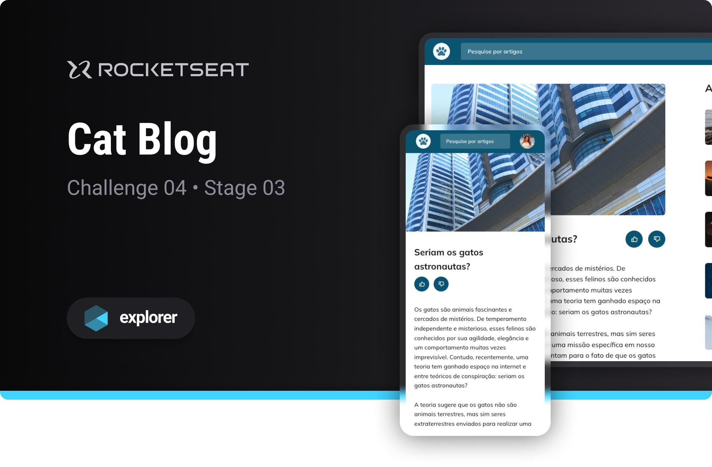

# Cat Blog

Challenge developed on Rocketseat's Explorer course

**Cat Blog is a blog designed to put into practice the basic concepts of web development**

## 🔗 Project Links

- 🚀 [**Deploy**](https://emanueltavecia.github.io/cat-blog)
- 🎨 [**Figma**](https://www.figma.com/community/file/1256354927622258124/blog-de-gatos-desafio-explorer)

## 📋 Project information

- Rocketseat Explorer
- Stage 03
- Challenge 04

## 🧠 Concepts learned

The development of this challenge aims to put the following concepts into practice:

- Responsiveness
- CSS styling
  - grid, variables, animations, transitions

## 💻 Technologies

## 📄 License

This project is licensed under the MIT License - see the [LICENSE](./LICENSE) file for more details.
